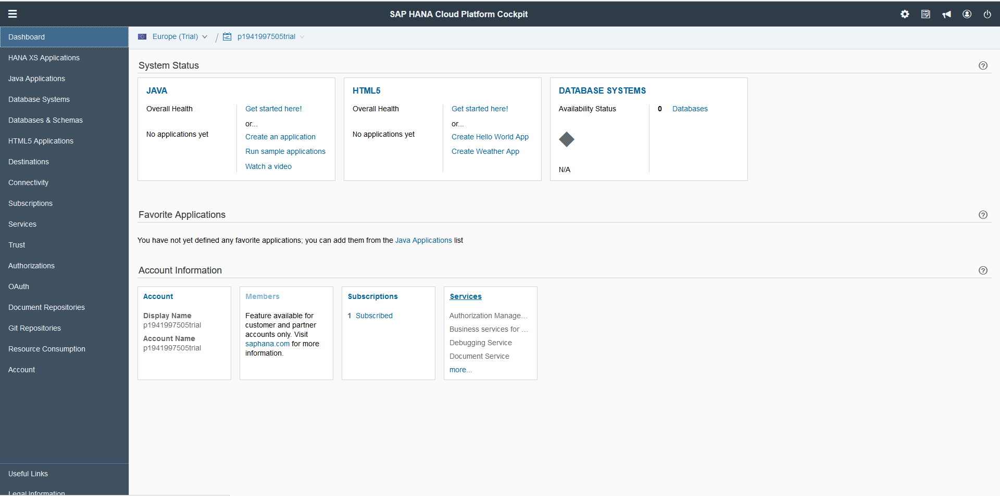
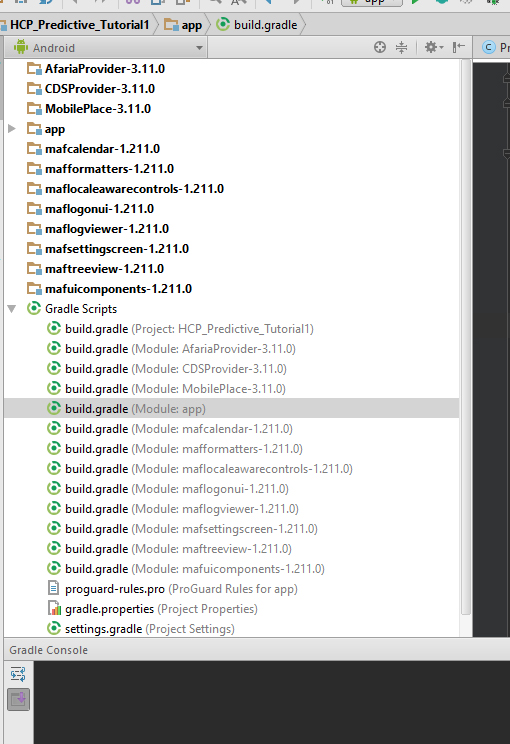
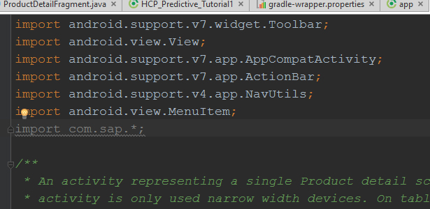

# SAP HANA predictive analytics in multiplatform apps

A [SAP HANA](https://hana.sap.com/abouthana.html) tutorial for use of predictive analytics in multiplatform (mobile devices) applications

## Tutorial key features

1. Introduction
    1. SAP HANA (HCP)
    2. HCP predictive analytics
    3. Swarm Computing & Swarm Logic
    4. Native mobile development
2. Kick-off: Identifying HCP core functionalities
3. Creating a native app (Android or iOS)
4. Importing and connecting with HCP API.
5. Testing on-demand real-time requests to HCP from our App.
6. Example uses of HCP in our Apps.

## Introduction
The following tutorial will explain the process to incorporate SAP HANA (Hana Cloud Platform) service to a native based mobile app (Android & iOS).
The advantages of incorporating HCP services to our mobile apps can be clearly measured if we consider the network structure of the mobile network and in general multiplatform network structures. All this will be explained in this section.

### SAP HANA (HCP)
SAP HANA is an on-demand database cloud service that using a powerful innovative collection of algorithms successfully offers an extremely fast communication method with a database structured information over the cloud. By developing these algorithms SAP was able to create a service that its response time is almost instantaneous, real time and by doing so it allowed to implement a complete new area of software app development. HCP by itself is divided to a number of services, and here we will discuss the predictive Analytics service.

### HCP predictive analytics
"Know thyself" is the inscription that can be found on the Oracle of Delhpi. In predictive analytics there is not much difference between that inscription and the use of predictive algorithms. Predictive analytics is the science in which we use a numerous amount of variables known to us (know thyself) and we apply them in complex multivariable functions to atain a result that predict future events interpreted by reading the results of such algorithms. With more variables the prediction if more precise. In present predictive analytics are used in many professional areas, i.e. risk measurement, geological surveys, strategical calculation and the most common use weather prediction. 

HCP predictive analytics is perhaps one of the strongest and most potential services that SAP HANA offers. By using its powerful real time access to data and overall architecture structure we can create our own predictive solution. By using two way communication we can both feed the database with information (variables) to use in the predictive algorithms and receive predicted solutions instantaneously. It is clear that predictions will be of higher precision with more up to date information, and fast response service la HCP will offer us a rich and strong backend solution for predictive needs.

### Swarm Computing & Swarm Logic
Using predictive analytics with mobile devices may come almost hand in hand. Swarm Computing refers to the use of large amount of electronic devices all interacting together and feeding each other with information. Mobile devices not only interact with a backend service, but also with surrounding devices, and the capability of allowing an interaction with surrounding devices increases the swarm intelligence of the system. Using HCP fast response times may solve many issues with on demand real-time needs of the members of a swarm system in a large area of use. Combining the swarm structure feedback of information with predictive analytics may serve of extreme use to those business models that may need real-time prediction of a swarm structured mobile app system.

### Native mobile development
To use the full potential of the predictive analytics of HCP, we will explain how to incorporate in our mobile apps (Android & iOS) the functionalities that HCP offers. Once the communication between our app and the HCP predictive API is working, we will make a number of example tests and check the scope of the system. It important to keep in mind that the topological network structure of our apps will be swarm based, so our predictive algorithms in the HCP service will always be up to date with the latest information from each member (node) of the swarm structure.

## Kick-off: Identifying HCP core functionalities
We are interested in using the Predictive Analysis Library (PAL). This library is offered by the HCP Sap team and allows the users to create table relations in the database structure on the cloud platform that complies with predictive functionality needs. 

Because we will make use of the PAL on the cloud platform, it is important to design an appropriate database structure using SAP Hana studio. Once the database is created correctly with its proper relations, from the mobile device we will be able to use either native java calls or SQL requests and receive the information to our app.

1.	First we will register to a HCP account in the following web page: [HCP SAP](https://hcp.sap.com/developers.html#section_4). Once completed you will be asked to activate the account.
2.	So now we log in and you will have the first peek at the HCP control panel.
3.	In the services section you will see all potential services we can activate and use in SAP HANA. Ensure to activate Mobile Services.
 
 

## Creating a native app (Android or iOS)
1. After you created your HANA Cloud Platform trial account, you will enable mobile services [Details](http://hcp.sap.com/developers/TutorialCatalog/webapp_01_enable_hcp_mobile_services_trial.html).
2. Then you will install Android Studio 2.1 [Download here](http://developer.android.com/intl/es/sdk/index.html) as well as SAP Hana Studio. 
3. Afterwards you will download and install the latest SAP Mobile Platform SDK and any patch releases [Download link](https://store.sap.com/sap/cpa/ui/resources/store/html/SolutionDetails.html?pid=0000013098&catID=MOB&pcntry=US&sap-language=EN&_cp_id=id-1441300266697-0).
4. Once you have all installed, you should save the path of the folder which the mobile platform SDK was installed (D:\Apps\SAP\MobileSDK3\ in my case).
5. You create an Android Studio project, minimum SDK version of 15. 
6. You edit the app.grade dependency section adding the following lines:

  * compile fileTree(include: '*.jar', dir: 'YOURPATH/MobileSDK3/NativeSDK/ODataFramework/Android/libraries')
  * compile fileTree(include: '*.jar', dir: ' YOURPATH/MobileSDK3/NativeSDK/MAFReuse/Android/libraries')

7. Finally for each *.aar file you may find in each folder inside the NativeSDK, you will create a “new module” and import it as an external AAR file. It will depend on what functionality you want to add to your app. In my case I have added all:

 
 
Remember to add the new modules to the “app” dependency list (File-project settings->dependencies).
If you complied with all this steps you should be able to import SAP Mobile Platform SDK methods to your app.
 

## Importing and connecting with HCP API.

## Testing on-demand real-time requests to HCP from our App.

## Example uses of HCP in our Apps.

## Credits
* [BeMyApp](https://bemyapp.com) - BeMyApp home page
* [SAP HANA](https://hana.sap.com) - SAP HANA home page
